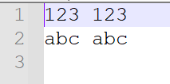
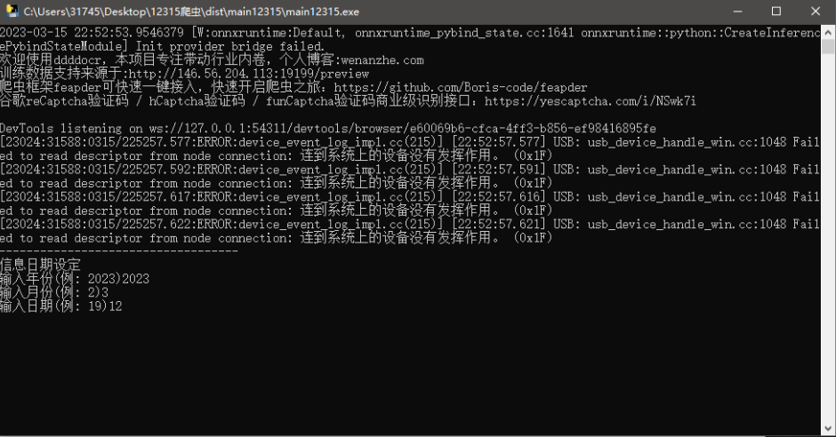
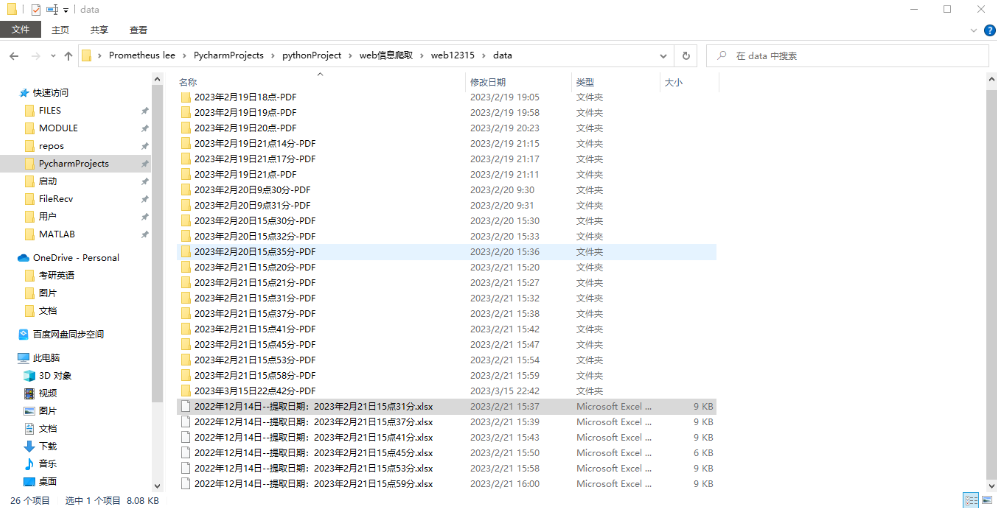
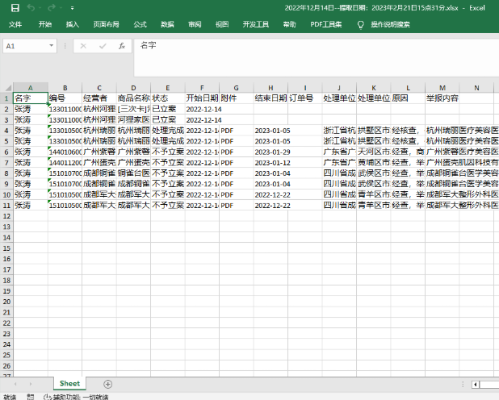
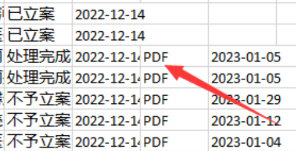

# web12315-Selenium
 基于Selenium的web12315爬虫

[chromedriver-download](http://chromedriver.storage.googleapis.com/index.html)

## 前置条件

1. 显示器分辨率在1600*900及以上，显示缩放率为100%

2. 安装chrome对应的chromedriver

## 原始数据

1. 在根目录下有“账号”文件夹，内部有.txt后缀的文件，其中填有账号密码信息：

2. 每一行一条账号信息，账号和密码以一个空格分隔。
3. 每次启动程序，都会依次登录这些账号，爬取信息。

## 运行

1. 双击在根目录下的main12315.exe文件。
2. 根据提示输入要提取数据的年月日即可。

## 爬取数据结果

1. 爬取得到的数据会放在根目录下的data中，内容如下图所示：

2. 会生成表格文件和pdf文件夹，pdf文件夹中放置的是爬取的pdf。
3. 表格如下图所示。

4. PDF为Excel超链接，单击即可跳转到该条信息相应的已经下载到本地pdf文件，并且pdf中文字内容可直接复制。

